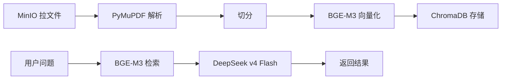

# Python 端改进分析：ModelX RAG → RAG 智能问答助手（AI 大脑）

> **技术路线：LangChain 0.3.x 不变 | ChromaDB 不变 | DeepSeek v4 Flash | BGE-M3 | PyMuPDF**
> 当前 Python 版本：3.12.10（已降级）

---

## 一、技术栈确认

| 组件 | 原有 | 目标 | 改动？ |
|------|------|------|--------|
| AI 编排框架 | **LangChain 0.3.9** | **LangChain 0.3.9（不变）** | ❌ 不动 |
| 向量数据库 | **ChromaDB 0.5.3** | **ChromaDB 0.5.3（不变）** | ❌ 不动 |
| 大模型（生成） | Ollama + qwen3:14b（本地） | **DeepSeek v4 Flash（云端 API）** | ⚠️ 换 |
| Embedding | Ollama qwen3-embedding:4b | **BGE-M3（via langchain-huggingface）** | ⚠️ 换 |
| Rerank | ❌ 无 | **BGE-Reranker（可选新增）** | ✨ 新增 |
| PDF 解析 | pypdf 5.1.0 | **PyMuPDF（fitz）** | ⚠️ 换 |
| Word/Excel/PPT | python-docx / openpyxl / python-pptx | 保留 | ❌ 不动 |
| OCR | PaddleOCR + PaddlePaddle | **去掉** | 🗑 删 |
| 异步任务 | BackgroundTasks | **Celery + Redis** | ✨ 新增 |
| 文件来源 | HTTP 上传 | **MinIO SDK 拉取** | ✨ 新增 |
| 鉴权 | ❌ 无 | **API Key 中间件** | ✨ 新增 |
| 业务 DB | MySQL 5.7（自己的） | **Java 端管理** | 🗑 挪走 |
| 缓存 | 内存 dict | **Redis**（独立服务） | ✨ 升级 |
| 前端 | Vue 3 自带 | **去掉 → Java 端做** | 🗑 删 |
| 知识库管理 | 自建 KB CRUD | **去掉 → Java 端做** | 🗑 删 |
| 容器化 | ❌ 无 | **Docker Compose（Python + Redis + DB）** | ✨ 新增 |

---

## 二、依赖变更清单

### 2.1 需要**删除**的包

```diff
-# ❌ 不再需要：Ollama 相关
-langchain-ollama==0.2.1

-# ❌ 不再需要：PaddleOCR + PaddlePaddle
-paddleocr==2.9.1
-paddlepaddle==2.6.2

-# ❌ 不再需要：PDF 从 pypdf 换到 PyMuPDF
-pypdf==5.1.0

-# ❌ 不再需要：老旧 .xls 格式
-xlrd==2.0.1

-# ❌ 不再需要：业务 DB 移给 Java 端
-pymysql==1.1.1
-alembic==1.14.0
-sqlalchemy==2.0.36      # 如需本地调试可保留
```

### 2.2 需要**新增**的包

```diff
+# ✅ DeepSeek v4 Flash（兼容 OpenAI SDK）
+langchain-openai>=0.2
+openai>=1.0

+# ✅ BGE-M3 Embedding（via langchain-huggingface）
+langchain-huggingface>=0.1
+sentence-transformers>=3.0
+torch>=2.3

+# ✅ BGE-Reranker（可选）
+langchain-community[cross-encoders]>=0.3

+# ✅ PDF 解析（PyMuPDF）
+PyMuPDF>=1.24

+# ✅ 异步任务队列
+celery>=5.4
+redis>=5.0

+# ✅ 对象存储（MinIO）
+minio>=7.2

+# ✅ 重试工具（API 限流备用）
+tenacity>=9.0
```

### 2.3 保留的包

```diff
 fastapi==0.115.5
 uvicorn[standard]==0.32.1
 python-multipart==0.0.12
-langchain-ollama==0.2.1      # 删
+langchain-openai>=0.2        # 新增
 langchain==0.3.9
 langchain-community==0.3.9
 langchain-core==0.3.21
 langchain-chroma==0.1.4
 chromadb==0.5.3
 python-docx==1.1.2
 openpyxl==3.1.5
 python-pptx==1.0.2
 pydantic==2.10.3
 pydantic-settings==2.6.1
 python-jose[cryptography]==3.3.0
 passlib[bcrypt]==1.7.4
 aiofiles==24.1.0
 httpx==0.28.1
 loguru==0.7.3
 python-dotenv==1.0.1
 chardet==5.2.0
 pillow==11.0.0               # 保留（PDF 转图片需要）
+PyMuPDF>=1.24                # 新增
+langchain-huggingface>=0.1   # 新增
+langchain-openai>=0.2        # 新增
+celery>=5.4                  # 新增
+redis>=5.0                   # 新增
+minio>=7.2                   # 新增
+tenacity>=9.0                # 新增
```

> 注：`sqlalchemy` 和 `pymysql` 在 Python 端完全不碰 MySQL 时可删；如需本地调试/读文档元数据，可保留。

---

## 三、核心改动：组件互换

### 3.1 LLM 替换：ChatOllama → ChatOpenAI（DeepSeek）

LangChain 0.3.x 原生支持 ChatOpenAI，DeepSeek 兼容 OpenAI 格式，**改动量 2 行**：

```python
# 原代码 — 改之前
from langchain_ollama import ChatOllama
llm = ChatOllama(
    base_url="http://localhost:11434",
    model="qwen3:14b",
    temperature=0.3,
)

# 新代码 — 改之后
from langchain_openai import ChatOpenAI
llm = ChatOpenAI(
    model="deepseek-chat",              # DeepSeek v4 Flash
    openai_api_key="sk-your-key",       # 从 .env 读
    openai_api_base="https://api.deepseek.com/v1",
    temperature=0.3,
    max_tokens=2048,
)
```

**后续 LCEL 链完全不动：** `chain = prompt | llm | StrOutputParser()` 照旧。

### 3.2 Embedding 替换：OllamaEmbeddings → HuggingFaceEmbeddings（BGE-M3）

```python
# 原代码 — 改之前
from langchain_ollama import OllamaEmbeddings
embeddings = OllamaEmbeddings(
    base_url="http://localhost:11434",
    model="qwen3-embedding:4b",
)

# 新代码 — 改之后
from langchain_huggingface import HuggingFaceEmbeddings
embeddings = HuggingFaceEmbeddings(
    model_name="BAAI/bge-m3",
    model_kwargs={"device": "cpu"},        # 无 GPU 用 CPU
    encode_kwargs={"normalize_embeddings": True},  # 归一化，支持 IP/余弦
)
```

**ChromaDB 对接** —— 完全兼容，无需改动：
```python
# 原代码 — 不动
from langchain_chroma import Chroma

vector_store = Chroma(
    client=chromadb.PersistentClient(path=settings.CHROMA_PERSIST_DIR),
    collection_name=f"kb_{kb_id}",
    embedding_function=embeddings,          # ← 替换后的 HuggingFaceEmbeddings
)
```

### 3.3 PDF 解析替换：pypdf → PyMuPDF（fitz）

```python
# 原代码 — 改之前
from pypdf import PdfReader
reader = PdfReader(file_path)
for page in reader.pages:
    text = page.extract_text()

# 新代码 — 改之后
import fitz  # PyMuPDF
doc = fitz.open(file_path)
for i, page in enumerate(doc):
    text = page.get_text()
    # 保留页码元数据
    # metadata = {"source": file_path, "page": i + 1}
doc.close()
```

> PyMuPDF（fitz）对中文 PDF 提取质量明显优于 pypdf，且支持图片页转 pixmap（`page.get_pixmap()`），**过去用 PaddleOCR 做 PDF 图片页 OCR 的场景可以直接用 fitz 转图 + 跳过 OCR**。

---

## 四、需要删除的功能

### 4.1 整个前端目录
**路径：** `rag/frontend/`
**原因：** 前端交给 Java 端（Vue 3 + Element Plus + TypeScript），Python 只做纯后台服务。

### 4.2 知识库管理（KB CRUD）
**路径：** `backend/app/api/kb.py`、`backend/app/models/knowledge_base.py`、`backend/app/schemas/kb.py`
**原因：** 业务层全移给 Java 端。Python 端不再需要 KnowledgeBase 表和 KB 路由。

> 需要保留 ChromaDB 的 collection 划分逻辑（目前按 `kb_id` 拆 collection），可改用统一的 collection + `doc_id`/`kb_id` 元数据过滤，或保留 KB 概念只做最小接口。

### 4.3 SSE 流式 + 会话管理
**路径：** `backend/app/api/chat.py`（stream + send 端点）、`backend/app/models/conversation.py`
**原因：** Java 端做代理中转，只接收 JSON 非流式响应。历史消息由 Java 端传递。

### 4.4 PaddleOCR + PaddlePaddle
**路径：** `backend/app/services/parser.py` 中所有 OCR 相关方法
**原因：**
1. Python 3.12 不支持 PaddlePaddle 预编译 wheel
2. 企业文档中纯图片识别场景极少
3. PDF 内图片页可以用 PyMuPDF 的 `page.get_pixmap()` 转图后简单处理，无需 OCR 引擎

### 4.5 本地路径导入
**路径：** `backend/app/api/document.py` 中的 `/api/doc/import-path`
**原因：** 文件来源只有 MinIO，无本地扫描场景。

### 4.6 xlrd（.xls 老旧格式支持）
**原因：** 企业场景中 .xls 已基本消亡，保留 openpyxl 处理 .xlsx 即可。

### 4.7 临时脚本
**路径：** `check_vectors.py`、`reindex.py`、`reindex_doc.py`、`test_query.py`
**原因：** 开发调试用，不再需要。

### 4.8 Ollama 连接测试
**文件：** `rag_service.test_connection()` 方法
**原因：** 不再使用 Ollama，改由健康检查接口统一处理。

---

## 五、需要新增的功能

### 5.1 API Key 鉴权中间件（P0）

`backend/app/core/auth.py`：

```python
from fastapi import Security, HTTPException
from fastapi.security import APIKeyHeader
from app.core.config import settings

api_key_header = APIKeyHeader(name="X-API-Key", auto_error=True)

async def verify_api_key(api_key: str = Security(api_key_header)):
    if api_key != settings.API_KEY:
        raise HTTPException(status_code=403, detail="Invalid API Key")
    return api_key
```

**配置新增：**
```python
API_KEY: str = "modelx-rag-secret-key"        # .env 中配置
```

### 5.2 MinIO 客户端（P0）

`backend/app/core/minio_client.py`：

```python
from minio import Minio
from app.core.config import settings

minio_client = Minio(
    settings.MINIO_ENDPOINT,
    access_key=settings.MINIO_ACCESS_KEY,
    secret_key=settings.MINIO_SECRET_KEY,
    secure=False,
)

def download_file(file_url: str, local_path: str):
    """从 MinIO 下载文件到本地临时目录"""
    parts = file_url.split("/")
    bucket = parts[3]
    object_name = "/".join(parts[4:])
    minio_client.fget_object(bucket, object_name, local_path)
```

**配置新增：**
```python
MINIO_ENDPOINT: str = "minio:9000"
MINIO_ACCESS_KEY: str = "minioadmin"
MINIO_SECRET_KEY: str = "minioadmin"
```

### 5.3 Rerank 服务（可选，P1）

```python
from langchain.retrievers import ContextualCompressionRetriever
from langchain.retrievers.document_compressors import CrossEncoderReranker
from langchain_community.cross_encoders import HuggingFaceCrossEncoder

model = HuggingFaceCrossEncoder(model_name="BAAI/bge-reranker-v2-m3")
compressor = CrossEncoderReranker(model=model, top_n=5)
rerank_retriever = ContextualCompressionRetriever(
    base_compressor=compressor,
    base_retriever=vector_store.as_retriever(search_kwargs={"k": 20}),
)
```

### 5.4 异步任务队列 + 状态管理（P0）

**Celery 配置** `backend/app/celery_app.py`：

```python
from celery import Celery
from app.core.config import settings

celery_app = Celery(
    "rag_tasks",
    broker=settings.CELERY_BROKER_URL,      # redis://localhost:6379/0
    backend=settings.CELERY_RESULT_BACKEND,  # redis://localhost:6379/0
)
```

**任务状态管理** `backend/app/services/task_manager.py`：

```python
import redis.asyncio as aioredis
import uuid

class TaskManager:
    def __init__(self):
        self.redis = aioredis.Redis(
            host=settings.REDIS_HOST,
            port=settings.REDIS_PORT,
            decode_responses=True,
        )

    def create(self) -> str:
        tid = f"task_{uuid.uuid4().hex[:12]}"
        self.redis.hset(f"task:{tid}", mapping={
            "status": "pending",
            "created_at": ...,
        })
        return tid

    async def get(self, task_id: str) -> dict | None:
        return await self.redis.hgetall(f"task:{task_id}")

    async def update(self, task_id: str, **kw):
        await self.redis.hset(f"task:{task_id}", mapping=kw)

task_manager = TaskManager()
```

### 5.5 DeepSeek v4 Flash LLM 工厂（P0）

```python
from langchain_openai import ChatOpenAI
from app.core.config import settings

def get_llm(streaming: bool = False) -> ChatOpenAI:
    return ChatOpenAI(
        model="deepseek-chat",
        openai_api_key=settings.DEEPSEEK_API_KEY,
        openai_api_base="https://api.deepseek.com/v1",
        temperature=0.3,
        max_tokens=2048,
        streaming=streaming,
    )
```

**配置新增：**
```python
DEEPSEEK_API_KEY: str = "sk-your-key"        # 从环境变量读
```

### 5.6 Prompt 安全护栏（P1）

```python
import re

INJECTION_PATTERNS = [
    r"忽略(以上|前面).*", r"ignore\s+all\s+instructions",
    r"forget\s+(everything|previous)",
]

def check_input_safety(text: str) -> bool:
    """输入检测：是否含 prompt injection"""
    for p in INJECTION_PATTERNS:
        if re.search(p, text, re.IGNORECASE):
            return False
    return True

def ensure_source_citation(answer: str, sources: list) -> str:
    """输出校验：确保来源标注存在"""
    if sources and "[来源：" not in answer:
        return answer + f"\n\n[来源：《{sources[0]['title']}》]"
    return answer
```

---

## 六、需要实现的新接口（Java ↔ Python）

### 接口 1：文档入库（异步）

```
POST /api/v1/documents/ingest
Authorization: X-API-Key <secret>
```

```json
{
  "file_url": "http://minio:9000/knowledge/docs/report.pdf",
  "document_id": "doc_001",
  "title": "环境评估报告",
  "department": "engineering",
  "visibility": "public",
  "version": "v1.0"
}
```

↳ 响应：`{ "task_id": "task_xxx", "status": "accepted" }`

**处理流程：** 创建 task → Celery 异步 → MinIO 下载 → PyMuPDF 解析 → 切分 → BGE-M3 向量化 → ChromaDB 存储 → 更新状态

### 接口 2：查询入库状态

```
GET /api/v1/documents/ingest/{task_id}
Authorization: X-API-Key <secret>
```

↳ 响应：
```json
{
  "task_id": "task_xxx",
  "status": "completed",       /* pending | processing | completed | failed */
  "document_id": "doc_001",
  "chunks_count": 42,
  "message": "解析完成，共生成 42 个文本块"
}
```

### 接口 3：智能问答

```
POST /api/v1/documents/query
Authorization: X-API-Key <secret>
```

```json
{
  "question": "环境评估报告里的噪音限值是多少？",
  "user_id": "user_zhangsan",
  "department": "engineering",
  "visibility_level": ["public", "engineering"],
  "top_k": 5,
  "history": [
    { "role": "user", "content": "..." },
    { "role": "assistant", "content": "..." }
  ]
}
```

↳ 响应：
```json
{
  "answer": "根据《环境评估报告》第三章规定，昼间噪音限值为65dB。",
  "sources": [
    {
      "document_id": "doc_001",
      "title": "环境评估报告",
      "chunk_text": "昼间噪音限值65dB...",
      "page": 3,
      "version": "v1.0",
      "score": 0.89
    }
  ],
  "confidence": "high",
  "model": "deepseek-chat"
}
```

**处理流程：** 鉴权 → 输入安全检查 → ChromaDB 检索（带 metadata where 过滤）→ 可选 Rerank → Prompt 组装 → DeepSeek 调用 → 输出校验 → 返回

### 接口 4：文档删除

```
DELETE /api/v1/documents/{document_id}/version/{version}
Authorization: X-API-Key <secret>
```

↳ 同步从 ChromaDB 中删除对应 `doc_id` + `version` 的所有 chunk。

**ChromaDB 中删除逻辑**（已有实现，验证增强）：
```python
col = chroma_client.get_collection(collection_name)
res = col.get(where={"doc_id": str(doc_id)})
if res["ids"]:
    col.delete(ids=res["ids"])
```

### 接口 5：健康检查

```
GET /api/v1/health
Authorization: X-API-Key <secret>
```

↳ 响应：
```json
{
  "status": "ok",
  "version": "1.0.0",
  "chroma_connected": true,
  "deepseek_available": true,
  "celery_running": true
}
```

---

## 七、需要保留并调整的功能

### 7.1 保留内容

| 文件/功能 | 保留策略 |
|-----------|---------|
| `backend/app/core/config.py` | 保留结构，扩充 MinIO/DeepSeek/Redis/Celery 配置 |
| `backend/app/services/cache.py` | 保留设计，底层从内存换成 Redis |
| `backend/app/services/retrieval_log.py` | 保留，扩充日志格式 |
| `backend/app/services/rag.py` | LCEL 链保留，换 LLM + Embedding + 加 Rerank |
| `backend/app/services/document.py` | 保留业务流程，文件源从 HTTP 改为 MinIO |
| `backend/app/schemas/` | 保留目录，内容替换为新接口模型 |
| `backend/main.py` | 保留框架，注册新路由 |
| `backend/.env` | 保留，内容替换 |

### 7.2 ChromaDB 元数据增强

**当前元数据字段**（不改也能用，但建议扩展）：

```python
# 当前
metadata = {
    "doc_id":       str(doc_id),
    "kb_id":        str(kb_id),
    "filename":     filename,
    "chunk_index":  str(i),
}

# 建议扩充（对接接口 1 的传参）
metadata = {
    "doc_id":       str(doc_id),
    "doc_title":    title,          # ← 新增：文档标题（溯源用）
    "kb_id":        str(kb_id),
    "department":   department,     # ← 新增：部门标签（权限过滤）
    "visibility":   visibility,     # ← 新增：可见范围（权限过滤）
    "version":      version,        # ← 新增：版本号（版本管理）
    "filename":     filename,
    "page":         page + 1,       # ← 新增：页码（溯源定位）
    "chunk_index":  str(i),
}
```

这样接口 3 的权限过滤就能通过 ChromaDB 的 `where` 实现：

```python
filter_expr = {"$or": [
    {"department": {"$eq": user_dept}},
    {"visibility": {"$eq": "public"}},
]}
# 如果 user_dept 有私有文档
# filter_expr = {"$and": [
#     {"visibility": {"$in": [user_dept, "public"]}},
# ]}
```

### 7.3 切分策略调整

```python
# 当前参数
chunk_size=1000, chunk_overlap=200

# 调优参数（中文内容，更精细）
from langchain.text_splitter import RecursiveCharacterTextSplitter

splitter = RecursiveCharacterTextSplitter(
    chunk_size=600,                # 中文字数
    chunk_overlap=80,
    separators=["\n\n", "\n", "。", "！", "？", "；", " ", ""],
    length_function=len,
)
```

---

## 八、文件变更清单

### 新增文件

| 路径 | 内容 |
|------|------|
| `backend/app/core/auth.py` | API Key 鉴权中间件 |
| `backend/app/core/minio_client.py` | MinIO 客户端 |
| `backend/app/services/embedding.py` | BGE-M3 Embedding（HuggingFaceEmbeddings） |
| `backend/app/services/reranker.py` | Rerank 可选封装 |
| `backend/app/services/task_manager.py` | 异步任务状态管理 |
| `backend/app/services/ingestion.py` | 文档入库流水线 |
| `backend/app/celery_app.py` | Celery 配置 |
| `backend/app/tasks/ingest_task.py` | Celery 异步任务 |
| `backend/Dockerfile` | Python 服务容器化 |
| `backend/.dockerignore` | Docker 构建忽略文件 |

### 修改文件

| 文件 | 修改内容 |
|------|---------|
| `backend/requirements.txt` | 删 PaddleOCR/Ollama/pypdf，加 langchain-openai/langchain-huggingface/PyMuPDF/Celery/Redis/MinIO |
| `backend/app/core/config.py` | 扩充 MinIO/DeepSeek/Redis/Celery 配置 |
| `backend/app/services/rag.py` | ChatOllama → ChatOpenAI，OllamaEmbeddings → BGE-M3，加 Rerank |
| `backend/app/services/parser.py` | pypdf → PyMuPDF，删 OCR，保留 Word/Excel/PPT 解析 |
| `backend/app/services/vector_store.py` | 扩充元数据字段，增强 where 过滤 |
| `backend/app/services/document.py` | 文件源改为 MinIO 拉取 |
| `backend/app/services/cache.py` | 内存 dict → Redis |
| `backend/app/services/retrieval_log.py` | 扩充日志字段 |
| `backend/app/schemas/__init__.py` | 替换为新接口模型 |
| `backend/app/api/` 全部 | 替换为 5 个新接口 |
| `backend/app/models/` | 精简或删除 |
| `backend/main.py` | 注册新路由、添加 API Key 中间件 |

### 删除文件/目录

| 路径 | 原因 |
|------|------|
| `rag/frontend/` 整个目录 | 前端交给 Java |
| `backend/app/api/kb.py` | 知识库管理移给 Java |
| `backend/app/api/chat.py` | 会话管理移给 Java |
| `backend/app/models/knowledge_base.py` | 同上 |
| `backend/app/models/conversation.py` | 同上 |
| `backend/app/models/document.py` | 视情况保留 |
| `backend/app/schemas/kb.py` | 同上 |
| `backend/app/schemas/chat.py` | 同上 |
| `backend/app/schemas/document.py` | 同上 |
| `backend/check_vectors.py` | 临时脚本 |
| `backend/reindex.py` | 临时脚本 |
| `backend/reindex_doc.py` | 临时脚本 |
| `backend/test_query.py` | 临时脚本 |
| `rag/images/` | 截图 |
| `rag/main.png` | 截图 |
| `rag/README.md` | 需重写 |

---

## 九、开发阶段建议

### Phase 1：最小闭环（1 周）

**目标：** 上传 PDF → 解析入库 → 问答出结果



**具体任务：**

1. [ ] 更新 `requirements.txt`
2. [ ] 实现 `core/auth.py` — API Key 鉴权
3. [ ] 实现 `services/embedding.py` — BGE-M3（HuggingFaceEmbeddings）
4. [ ] 重写 `services/parser.py` — PyMuPDF 替换 pypdf
5. [ ] 重写 `services/vector_store.py` — 扩充元数据
6. [ ] 实现 `core/minio_client.py` — MinIO 拉文件
7. [ ] 重写 `services/rag.py` — ChatOpenAI 替换 ChatOllama
8. [ ] 实现接口 1（入库）+ 接口 2（状态）
9. [ ] 实现接口 3（问答）+ 接口 4（删除）+ 接口 5（健康检查）
10. [ ] **联调：上传 PDF → 解析 → 问出结果**

**学习重点：**
- 体会 LangChain 的「组件即插即用」模式（换 LLM、换 Embedding 都是改 import）
- ChromaDB 的 metadata 过滤机制

### Phase 2：异步 + 增强（1 周）

1. [ ] 实现 Celery 异步任务 + TaskManager
2. [ ] 接口 1 改为 Celery 异步入库
3. [ ] 实现 BGE-Reranker + ContextualCompressionRetriever
4. [ ] 缓存服务升级到 Redis
5. [ ] Prompt 模板优化 + 安全护栏

**学习重点：**
- Celery 任务队列模式
- Rerank 原理与 LangChain ContextualCompression

### Phase 3：完善（1 周）

1. [ ] 分层切分策略（语义边界 + 大小切分）
2. [ ] 错误处理 + API 重试 + 降级
3. [ ] 日志全面优化
4. [ ] 删除旧代码（前端、KB、会话等）
5. [ ] Dockerfile + docker-compose.yml

**学习重点：** 生产级 RAG 工程完整链路

---

## 十、注意事项

1. **LangChain 0.3.x 兼容性：** `langchain-openai>=0.2` 和 `langchain-huggingface>=0.1` 均兼容 0.3.x 版本，直接 `pip install` 即可，无需升级 LangChain 本体
2. **BGE-M3 模型体积：** 约 2.2GB，首次运行会自动下载。指定 `device="cpu"` 避免 GPU 报错，缓存到 `~/.cache/huggingface/`
3. **BGE-Reranker 模型：** 约 1.5GB，使用 CrossEncoder，可通过 `HuggingFaceCrossEncoder` 直接加载
4. **PyMuPDF（fitz）：** 对中文 PDF 提取质量明显优于 pypdf。注意 Windows 需要安装 `PyMuPDF` 包（已预编译 wheel，直接 pip 即可）
5. **DeepSeek API 限流：** 免费账户有 RPM 限制（通常 60 RPM），建议用 `tenacity` 做指数退避重试
6. **ChromaDB 元数据过滤限制：** ChromaDB 的 `$in`、`$and`、`$or` 操作符仅部分支持，不如 Milvus 灵活。权限过滤方案可简化为 Java 端预过滤（传参）→ Python 端按 `where` 过滤
7. **Redis 本地开发：** Windows 上可使用 Docker 运行 `redis:7`，或使用 Memurai（Windows 原生 Redis 替代品）
8. **Celery 本地调试：** 开发阶段可先不用 Celery，用 FastAPI 的 `BackgroundTasks` 临时替代，Phase 2 再正式上 Celery
9. **遗留问题：** 旧 `C:\Python314` 权限不足没删掉。新终端中如果 `python` 仍指向 3.14，去 `系统环境变量 → Path` 中移除 `C:\Python314` 和 `C:\Python314\Scripts\`
